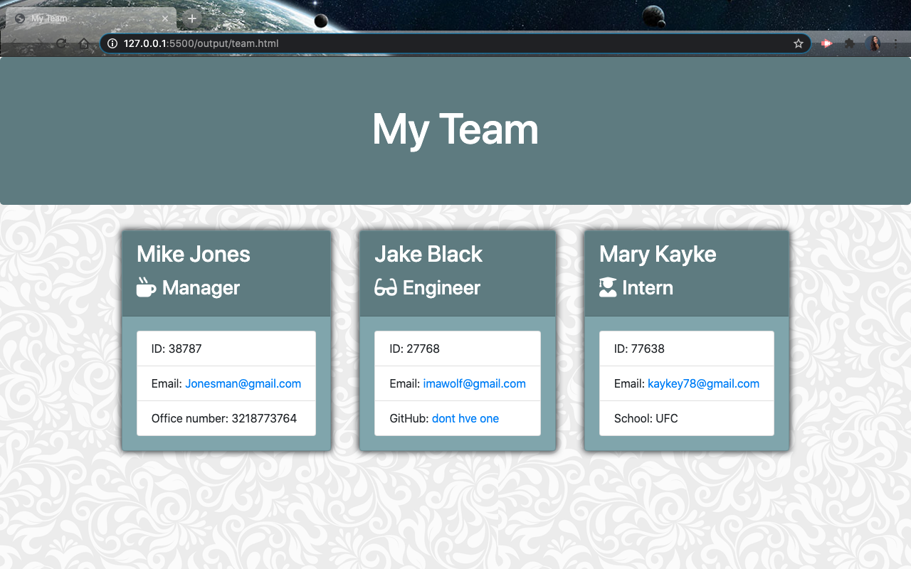

# HTMLteambuilder

# Description

Team generator command line application that uses Node CLI to build a team-displaying HTML file for a user based on their input. The user inputs a team name for a mananger,intern and new engineer. they will also be prompt to enter their id number, email and more. This question will generates in a static page and organizies their information.

##  Visuals

## Installation
Run node.js and perform an npm install to bring in all necesarry node modules. The program is run with the command "node app.js"

## License
Licensed under the MIT license
